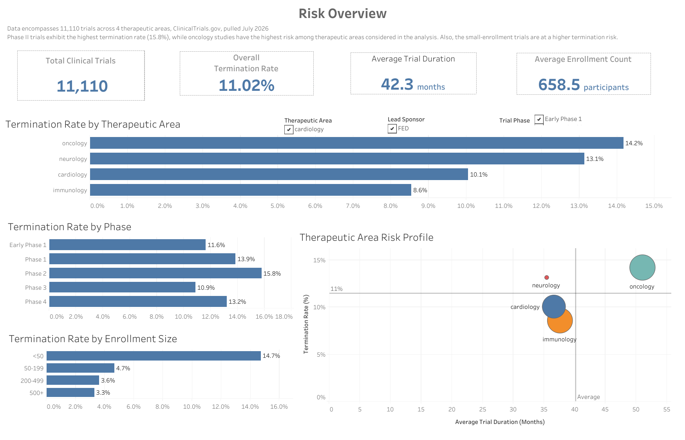

# Clinical Trial Portfolio & Risk Intelligence Dashboard

An end-to-end analytics project examining termination risk across 11,110 clinical trials, designed to identify which trial characteristics (therapeutic area, phase, enrollment size) are associated with the highest risk of early termination.

🔗 **[View the live interactive dashboard on Tableau Public](https://public.tableau.com/views/Clinical_Trials_analysis/RiskOverview)**



---

## Overview

Clinical trial termination can significantly increase development costs and delay new therapies. This project analyzes 11,110 clinical trials from ClinicalTrials.gov to identify patterns associated with trial termination, focusing on therapeutic area, trial phase, and enrollment size.

**Data source:** ClinicalTrials.gov API v2, pulled July 2026
**Scope:** 11,110 trials across oncology, neurology, cardiology, and immunology

## Key Findings

- **Phase 2 trials have the highest termination rate (15.8%)** of any phase — higher than even Phase 1, suggesting the largest drop-off risk occurs after early safety signals but before late-stage confirmation.
- **Oncology carries the highest termination risk (14.2%)** among the four therapeutic areas studied, despite also having among the longest average trial durations.
- **Small-enrollment trials (<50 participants) terminate at 14.7%** — over 4x the rate of trials with 500+ participants (3.3%), pointing to enrollment size as a strong risk signal independent of therapeutic area or phase.

## Skills Demonstrated

- Data Cleaning & Validation
- Exploratory Data Analysis (EDA)
- SQL Aggregation & Grouping
- Data Visualization
- KPI Design
- Dashboard Development
- Healthcare Analytics

## Pipeline

| Stage | File | What it does |
|---|---|---|
| 1. Data Collection | `Scripts/01_data_collection.py` | Pulls trial records from the ClinicalTrials.gov API v2 across four therapeutic areas |
| 2. Data Cleaning | `Scripts/02_data_cleaning.py` | Standardizes trial phases, calculates trial duration, flags terminated trials |
| 3. Database Load | `Scripts/03_load_to_sqlite.py` | Loads cleaned data into a SQLite database with indexes for query performance |
| 4. Analysis | `SQL/04_analysis_queries.sql`, `SQL/04a_analysis_queries.sql` | SQL queries covering termination rates, duration, sponsor class, enrollment risk, and phase/therapeutic-area breakdowns |
| 5. Visualization | `Tableau_dashboard/Clinical_Trials_analysis.twb` | Tableau dashboard built on the analysis query outputs |

## Tools & Tech

- **Python** (pandas) — data collection and cleaning
- **SQLite** — data storage and querying
- **DBeaver** — SQL client used for query development and validation
- **Tableau Public** — dashboard and visualization

## Repository Structure

```
Capstone_Project/
├── Scripts/
│   ├── 01_data_collection.py
│   ├── 02_data_cleaning.py
│   └── 03_load_to_sqlite.py
├── SQL/
│   ├── 04_analysis_queries.sql
│   └── 04a_analysis_queries.sql
├── SQL_query_results/        # Query output exports (Q1–Q7)
├── Tableau_dashboard/
│   ├── Clinical_Trials_analysis.twb
│   ├── Clinical_Trials_analysis.twbx
│   └── Risk_overview_dashboard_preview.png
├── Data/                     # Raw/processed data + SQLite DB (gitignored)
├── cleaning_summary.md
└── README.md
```

## Requirements

- Python 3.12+
- pandas
- requests
- SQLite
- Tableau Public

## Future Enhancements

- Incorporate additional therapeutic areas.
- Automate data refresh from the ClinicalTrials.gov API.

## Notes on the Analysis

- Trials marked "Not Applicable" for phase were excluded from phase-based analysis to keep comparisons consistent.
- Termination reason categorization (Q4) is an area of ongoing refinement — a meaningful share of terminated trials currently fall under an "Other/unspecified" reason code, which is being investigated further.

---

*This project demonstrates an end-to-end analytics workflow encompassing data acquisition, cleaning, SQL-based analysis, and interactive dashboard development using Python, SQLite, and Tableau.*
